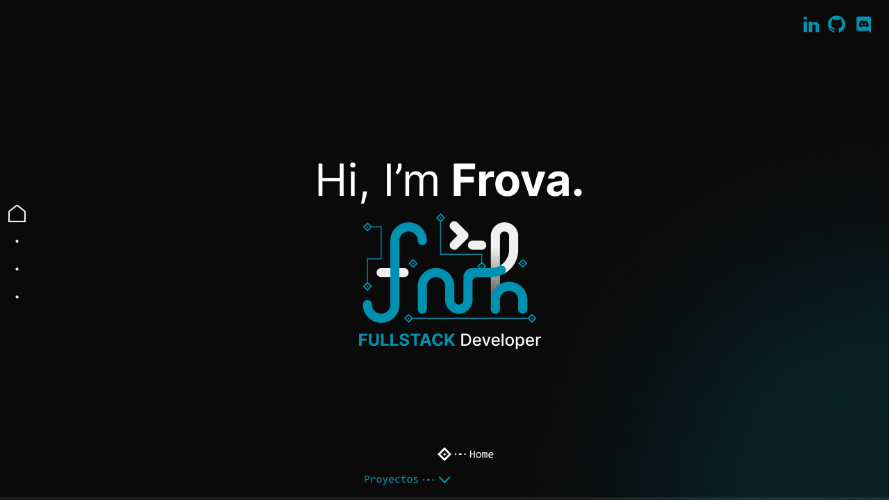
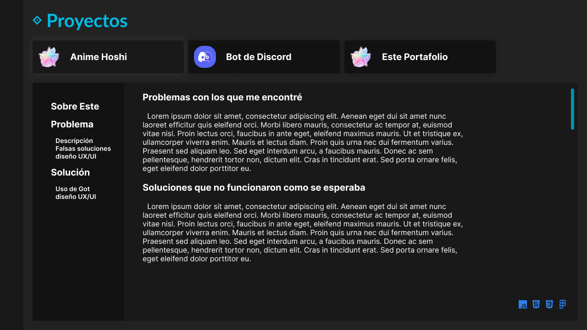

# Portafolio
Este sitio web fue construido para mostrar mis habilidades técnicas y habilidades de diseño web.
El mismo fue hecho con react, basado en plantilla de vite.
## Comandos
### Instalación
``` bash
~$ npm install
```
### Desarrollo
``` bash
~$ npm run dev
```
### building
``` bash
~$ npm run build
```
## Pre-diseño en Figma
### El Home
Este el que menos cambio Presento el resultado final.<br>



### Los proyectos
El concepto era explayarme en la experiencia adquirida desde los diferentes proyectos y como enfrente los problemas que me iban surgiendo en los mismos, la idea original era integrar la información junto con el portafolio en forma de artículos personalizado, pero descarte la idea y tire de los readmes de los mismos.<br>



### El About Me
este no tuvo un diseño preliminar solo me base en uno ya existente.
